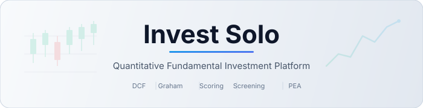
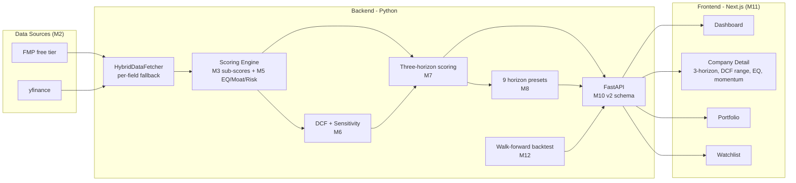

<p align="center">
  <picture>
    <source media="(prefers-color-scheme: dark)" srcset="docs/assets/banner-dark.svg">
    <source media="(prefers-color-scheme: light)" srcset="docs/assets/banner-light.svg">
    
  </picture>
</p>

<p align="center">
  <strong>Quantitative fundamental investment platform for PEA-eligible and global stock analysis</strong>
</p>

<p align="center">
  <a href="LICENSE"></a>
  <a href="#"></a>
  <a href="#"></a>
  <a href="#"></a>
  <a href="#"></a>
</p>

---

## What's new in v2 (M0–M12)

The v2 release rebuilt the scoring engine from the data layer up. Headline changes:

- **Three-horizon scoring** — every ticker gets independent Long-Term, Medium-Term, and Short-Term composites with their own weights, gates, and signals. No more single-number conflation. ([ADR-0001](docs/adr/0001-three-horizon-scoring.md))
- **Sector-relative percentile ranks** — replaces the v1 linear map that systematically penalised software and flattered utilities. ([ADR-0003](docs/adr/0003-sector-relative-percentile.md))
- **Real Piotroski + Altman Z''** — actual year-over-year deltas, real working capital and retained earnings. No more fabricated proxies. ([ADR-0004](docs/adr/0004-no-fabricated-values.md))
- **Two-stage DCF with 3×3 sensitivity grid** — the Strong Buy gate (composite ≥ 80 AND MoS ≥ 30%) finally bites.
- **FMP + yfinance hybrid** — per-field fallback through a `MarketDataSource` Protocol, with a `field_sources` audit trail and 24h fundamentals cache. ([ADR-0002](docs/adr/0002-fmp-yfinance-hybrid.md))
- **Earnings Quality, Moat, Real Risk** — Beneish M-Score, Sloan accruals, CCR, gross profitability, ROIC stability, realised vol, max drawdown.
- **9 horizon presets** — `LT_QUALITY_COMPOUNDER`, `LT_PEA_DEFENSIVE`, `LT_DEEP_VALUE`, `MT_GARP`, `MT_TURNAROUND`, `MT_INCOME`, `ST_MOMENTUM_QUALITY`, `ST_EARNINGS_DRIFT`, `ST_OVERSOLD_BOUNCE`.
- **Walk-forward backtest framework** — alpha tests per preset against CAC 40 / S&P 500.
- **Three-horizon UI** — `HorizonSelector`, `DCFFairValueRange`, `EarningsQualityPanel`, `MomentumPanel`, `CTOWarningBanner`.

Start at [`docs/PROJECT_BRIEF.md`](docs/PROJECT_BRIEF.md) for the architectural map, [`docs/METHODOLOGY.md`](docs/METHODOLOGY.md) for the methodology, [`docs/DATA_SOURCES.md`](docs/DATA_SOURCES.md) for the data layer, and [`CHANGELOG.md`](CHANGELOG.md) for the milestone-by-milestone history.

---

## What This Does

Invest Solo is a full-stack quantitative analysis platform that helps individual investors make data-driven decisions using academic valuation models.

- **Screen** stocks across 9 horizon-aware presets (3 long-term, 3 medium-term, 3 short-term)
- **Score** companies on three independent 0–100 composites (LT / MT / ST), each with sector-relative sub-scores
- **Value** with a two-stage DCF (sensitivity grid), Graham Number, and sector-relative multiples
- **Generate** Strong Buy / Buy / Hold / Sell / Strong Sell signals per horizon, each gated by data completeness, distress, and liquidity
- **Track** portfolios with risk metrics (Sharpe, VaR, max drawdown)
- **Report** daily market summaries and deep-dive company analyses
- **Comply** with French PEA tax-advantaged account rules (EU/EEA stocks); short-term signals on PEA-eligible names trigger an explicit CTO recommendation

## Architecture



## Project Structure

```
invest/
├── backend/                  # FastAPI REST API
│   └── app/
│       ├── api/              # Route handlers (company, market, screener, portfolio, watchlist)
│       ├── models/           # Pydantic data models
│       ├── services/         # Business logic (scoring, screening, data fetching)
│       └── storage/          # JSON-based persistence
├── frontend/                 # Next.js 16 React application
│   └── src/
│       ├── app/              # Pages (dashboard, screener, company, portfolio, watchlist)
│       ├── components/       # Reusable UI components (ScoreGauge, SignalBadge, etc.)
│       ├── hooks/            # Custom React hooks
│       └── lib/              # API client, types, formatters
├── src/                      # Core Python analysis engine
│   ├── analysis/             # Composite scoring system
│   ├── strategy/             # Stock screening logic
│   ├── reporting/            # Charts, dashboards, Excel/PDF export
│   └── data/                 # Sample stock universes
├── docs/                     # Documentation & methodology
│   ├── PROJECT_BRIEF.md      # Full architecture & design decisions
│   ├── METHODOLOGY.md        # Valuation formulas & models explained
│   ├── PEA_RULES.md          # French PEA eligibility & tax rules
│   └── DATA_SOURCES.md       # API references & data providers
├── settings.yaml             # Global configuration (scoring weights, thresholds)
├── .env.example              # API key template
└── Makefile                  # Common commands
```

## Quick Start

### Prerequisites

- Python 3.11+
- Node.js 18+
- bun

### Installation

```bash
# Clone the repository
git clone https://github.com/TomSOhm/invest.git
cd invest

# Set up API keys (optional — yfinance works without keys)
cp .env.example .env
# Edit .env with your API keys (see .env.example for providers)

# Install Python dependencies (uv recommended; pip fallback below)
uv sync --frozen
# Fallback if uv not installed: pip install -r backend/requirements.txt

# Install frontend dependencies
cd frontend && npm ci && cd ..
```

### Running

```bash
# Start the backend API (port 8000)
make backend

# Start the frontend dev server (port 3000) — in another terminal
make frontend

# Or run the standalone screener engine
python src/main.py

# Run daily analysis pipeline
python src/daily_run.py
```

Open [http://localhost:3000](http://localhost:3000) to access the dashboard.

## Investment Strategies

| Strategy         | Universe                       | Constraints                           | Use Case                           |
| ---------------- | ------------------------------ | ------------------------------------- | ---------------------------------- |
| **PEA**    | EU/EEA headquartered companies | Long-only, no leverage, tax-optimized | French investors with PEA accounts |
| **Global** | All publicly traded companies  | Unconstrained, fundamental-driven     | General value investing            |

## Scoring Methodology

Every ticker gets **three independent composite scores** (0–100) — one per horizon — plus per-horizon signals and gate states. Default category weights (set in `settings.yaml` `horizons:`):

| Category           | Long-Term | Medium-Term | Short-Term |
| ------------------ | --------- | ----------- | ---------- |
| Valuation          | 20%       | 20%         | 5%         |
| Profitability      | 25%       | 15%         | 5%         |
| Health             | 15%       | 15%         | 10%        |
| Earnings Quality   | 10%       | 10%         | 5%         |
| Growth             | 10%       | 15%         | 5%         |
| Capital Allocation | 10%       | 5%          | 5%         |
| Risk               | 10%       | 10%         | 10%        |
| Momentum           | —        | 10%         | 55%        |

Each sub-score is a **sector-relative percentile rank** (0–100) computed via `df.groupby(Sector)[metric].rank(pct=True) * 100`. Sectors with fewer than 5 peers fall back to global rank.

Signals combine the composite score with the **DCF margin of safety** (`MoS = (intrinsic − price) / price`):

| Signal      | Composite | MoS                              |
| ----------- | --------- | -------------------------------- |
| Strong Buy  | ≥ 80     | ≥ 30% (price < 70% intrinsic)   |
| Buy         | ≥ 65     | ≥ 15% (price < 85% intrinsic)   |
| Hold        | 40–80    | -15%–15%                        |
| Sell        | ≤ 40     | OR ≤ -15%                       |
| Strong Sell | —        | ≤ -30% (price > 130% intrinsic) |

When DCF can't be computed (e.g. for financials or names with missing FCF), the rule degrades gracefully to legacy composite-only thresholds.

See [docs/METHODOLOGY.md](docs/METHODOLOGY.md) for the full methodology, and [CHANGELOG.md](CHANGELOG.md) for the milestone-by-milestone history.

## Tech Stack

| Layer               | Technologies                                               |
| ------------------- | ---------------------------------------------------------- |
| **Backend**   | Python 3.11+, FastAPI, Pydantic, pandas, numpy, scipy      |
| **Data**      | yfinance, Financial Modeling Prep, Alpha Vantage, Finnhub  |
| **Analysis**  | FinanceToolkit, Plotly, matplotlib, seaborn                |
| **Frontend**  | Next.js 16, React 19, TypeScript, Tailwind CSS 4, Recharts |
| **Reporting** | openpyxl, fpdf2, python-docx, Jinja2                       |

## Configuration

All parameters are configurable via [`settings.yaml`](settings.yaml):

- Scoring weights and signal thresholds
- Valuation model parameters (DCF discount rates, Graham multipliers)
- Portfolio constraints (max position size, sector exposure limits)
- Risk parameters (VaR confidence, max drawdown alerts)
- Screening filters (min market cap, volume, years listed)
- PEA-eligible country list

API keys are managed through `.env` (see [`.env.example`](.env.example) for setup).

## Documentation

| Document                                                    | Description                                                        |
| ----------------------------------------------------------- | ------------------------------------------------------------------ |
| [PROJECT_BRIEF.md](docs/PROJECT_BRIEF.md)                      | Architecture, folder layout, three-horizon scoring overview        |
| [METHODOLOGY.md](docs/METHODOLOGY.md)                          | v2 methodology: sub-scores, DCF, gates, output schema              |
| [DATA_SOURCES.md](docs/DATA_SOURCES.md)                        | FMP + yfinance hybrid, coverage matrix, caching                    |
| [PEA_RULES.md](docs/PEA_RULES.md)                              | French PEA eligibility criteria and tax rules                      |
| [docs/adr/](docs/adr/)                                         | Architectural Decision Records (5 ADRs documenting the v2 rewrite) |
| [docs/backtests/methodology.md](docs/backtests/methodology.md) | Backtest framework: assumptions, biases, statistical caveats       |
| [CHANGELOG.md](CHANGELOG.md)                                   | Milestone-by-milestone (M0–M12) version history                   |
| [openapi_v2.json](openapi_v2.json)                             | Frozen v2 OpenAPI spec                                             |

## Contributing

Contributions are welcome! Please read the [Contributing Guide](CONTRIBUTING.md) for details on the development workflow, code style, and how to submit pull requests.

## Community

- [Code of Conduct](CODE_OF_CONDUCT.md) — the standards for participation in this project.
- [Contributing Guide](CONTRIBUTING.md) — how to set up a dev environment, run tests, and submit PRs.
- [GitHub Discussions](https://github.com/TomSOhm/invest/discussions) — questions, screening results, strategy talk.
- **Security**: report vulnerabilities privately via the repo's [GitHub Security tab](https://github.com/TomSOhm/invest/security/advisories/new).

## License

This project is licensed under the Apache License 2.0 — see the [LICENSE](LICENSE) file for details.

## Known Limitations

These are documented constraints of the current architecture. Track or contribute
fixes via [GitHub Issues](https://github.com/TomSOhm/invest/issues).

- **No true batch fundamentals API for yfinance.** `yf.Tickers` and similar
  helpers look like batch APIs but issue one HTTP call per ticker internally;
  `yf.download` is genuinely batched but only covers price history, not
  fundamentals (income statement, balance sheet, cash flow, info). Mitigation
  in v2: parallel fetch via `ThreadPoolExecutor` (configurable
  `screener.streaming.max_workers`, default 8) and SSE progress streaming
  through `GET /api/screener/refresh/stream`.

- **Screener refresh fan-out.** The PEA universe is ~127 tickers and each
  ticker requires ~5 yfinance endpoints (info, financials, balance, cashflow,
  history) → ~600 HTTP calls per cold refresh. Atténuations en place: 4h–24h
  on-disk per-field cache (`data/cache/`), parquet snapshot of the scored
  universe (`screener_scored.parquet`), 8 parallel workers, and SSE so the UI
  shows a live progress bar instead of a frozen spinner.

- **Yahoo rate-limiting.** Pushing `max_workers` above ~16 reliably triggers
  HTTP 429 responses and short IP bans. The default (8) is empirically stable;
  raise it cautiously and only if your IP is dedicated.

- **Sector-relative scores recomputed in one batch.** Composite scores depend
  on sector-median percentile ranks, which require the full scored universe.
  The stream therefore only emits *progress* events during the fetch — final
  scored rows arrive in the terminal `done` event, not per-ticker.

- **Possible future improvements** (tracked in the issue tracker): adopt a
  true batch-fundamentals source (Polygon, Financial Modeling Prep's `/v3/profile`
  multi-symbol endpoint, Alpha Vantage premium); pre-warm the parquet cache
  via a nightly cron so the UI is instant for users.

## Disclaimer

This software is provided for **educational and informational purposes only**. It does not constitute financial advice, investment recommendations, or an offer to buy or sell securities. Past performance does not guarantee future results. Always conduct your own research and consult a qualified financial advisor before making investment decisions. The authors assume no liability for any financial losses incurred through the use of this software.
