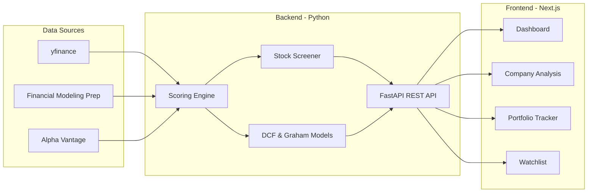

<p align="center">
  <picture>
    <source media="(prefers-color-scheme: dark)" srcset="docs/assets/banner-dark.svg">
    <source media="(prefers-color-scheme: light)" srcset="docs/assets/banner-light.svg">
    
  </picture>
</p>

<p align="center">
  <strong>Quantitative fundamental investment platform for PEA-eligible and global stock analysis</strong>
</p>

<p align="center">
  <a href="LICENSE"></a>
  <a href="#"></a>
  <a href="#"></a>
  <a href="#"></a>
  <a href="#"></a>
  <a href="https://github.com/TomSOhm/invest/issues"></a>
  <a href="https://github.com/TomSOhm/invest/pulls"></a>
</p>

---

## What This Does

Invest Solo is a full-stack quantitative analysis platform that helps individual investors make data-driven decisions using academic valuation models.

- **Screen** thousands of stocks using scientific valuation criteria
- **Score** companies on a 0-100 composite scale across 6 dimensions
- **Value** companies using DCF, Graham Number, and relative valuation models
- **Generate** Buy / Hold / Sell signals based on rigorous thresholds
- **Track** portfolios with risk metrics (Sharpe ratio, VaR, max drawdown)
- **Report** daily market summaries and deep-dive company analyses
- **Comply** with French PEA tax-advantaged account rules (EU/EEA stocks)

## Architecture



## Project Structure

```
invest/
├── backend/                  # FastAPI REST API
│   └── app/
│       ├── api/              # Route handlers (company, market, screener, portfolio, watchlist)
│       ├── models/           # Pydantic data models
│       ├── services/         # Business logic (scoring, screening, data fetching)
│       └── storage/          # JSON-based persistence
├── frontend/                 # Next.js 16 React application
│   └── src/
│       ├── app/              # Pages (dashboard, screener, company, portfolio, watchlist)
│       ├── components/       # Reusable UI components (ScoreGauge, SignalBadge, etc.)
│       ├── hooks/            # Custom React hooks
│       └── lib/              # API client, types, formatters
├── src/                      # Core Python analysis engine
│   ├── analysis/             # Composite scoring system
│   ├── strategy/             # Stock screening logic
│   ├── reporting/            # Charts, dashboards, Excel/PDF export
│   └── data/                 # Sample stock universes
├── docs/                     # Documentation & methodology
│   ├── PROJECT_BRIEF.md      # Full architecture & design decisions
│   ├── METHODOLOGY.md        # Valuation formulas & models explained
│   ├── PEA_RULES.md          # French PEA eligibility & tax rules
│   └── DATA_SOURCES.md       # API references & data providers
├── settings.yaml             # Global configuration (scoring weights, thresholds)
├── .env.example              # API key template
└── Makefile                  # Common commands
```

## Quick Start

### Prerequisites

- Python 3.11+
- Node.js 18+
- bun

### Installation

```bash
# Clone the repository
git clone https://github.com/TomSOhm/invest.git
cd invest

# Set up API keys (optional — yfinance works without keys)
cp .env.example .env
# Edit .env with your API keys (see .env.example for providers)

# Install Python dependencies
pip install -r requirements.txt

# Install frontend dependencies
cd frontend && bun install && cd ..
```

### Running

```bash
# Start the backend API (port 8000)
make backend

# Start the frontend dev server (port 3000) — in another terminal
make frontend

# Or run the standalone screener engine
python src/main.py

# Run daily analysis pipeline
python src/daily_run.py
```

Open [http://localhost:3000](http://localhost:3000) to access the dashboard.

## Investment Strategies

| Strategy | Universe | Constraints | Use Case |
|----------|----------|-------------|----------|
| **PEA** | EU/EEA headquartered companies | Long-only, no leverage, tax-optimized | French investors with PEA accounts |
| **Global** | All publicly traded companies | Unconstrained, fundamental-driven | General value investing |

## Scoring Methodology

Each company receives a composite score from 0 to 100, weighted across six dimensions:

| Dimension | Weight | What It Measures |
|-----------|--------|-----------------|
| Valuation | 25% | Price vs. intrinsic value (DCF, Graham) |
| Financial Health | 20% | Debt ratios, Altman Z-Score, Piotroski F-Score |
| Profitability | 20% | ROE, ROA, operating margins |
| Growth | 15% | Revenue & earnings growth trends |
| Shareholder Return | 10% | Dividends, buybacks |
| Risk | 10% | Beta, volatility, max drawdown |

Signals are generated based on score thresholds and price-to-intrinsic-value ratios:

| Signal | Score | Price vs. Intrinsic |
|--------|-------|-------------------|
| Strong Buy | 80+ | < 70% |
| Buy | 65+ | < 85% |
| Hold | 40-65 | — |
| Sell | < 40 | > 130% |
| Strong Sell | < 25 | > 150% |

See [docs/METHODOLOGY.md](docs/METHODOLOGY.md) for detailed formulas.

## Tech Stack

| Layer | Technologies |
|-------|-------------|
| **Backend** | Python 3.11+, FastAPI, Pydantic, pandas, numpy, scipy |
| **Data** | yfinance, Financial Modeling Prep, Alpha Vantage, Finnhub |
| **Analysis** | FinanceToolkit, Plotly, matplotlib, seaborn |
| **Frontend** | Next.js 16, React 19, TypeScript, Tailwind CSS 4, Recharts |
| **Reporting** | openpyxl, fpdf2, python-docx, Jinja2 |

## Configuration

All parameters are configurable via [`settings.yaml`](settings.yaml):

- Scoring weights and signal thresholds
- Valuation model parameters (DCF discount rates, Graham multipliers)
- Portfolio constraints (max position size, sector exposure limits)
- Risk parameters (VaR confidence, max drawdown alerts)
- Screening filters (min market cap, volume, years listed)
- PEA-eligible country list

API keys are managed through `.env` (see [`.env.example`](.env.example) for setup).

## Documentation

| Document | Description |
|----------|-------------|
| [PROJECT_BRIEF.md](docs/PROJECT_BRIEF.md) | Full architecture, design decisions, and roadmap |
| [METHODOLOGY.md](docs/METHODOLOGY.md) | Every valuation formula and model explained |
| [PEA_RULES.md](docs/PEA_RULES.md) | French PEA eligibility criteria and tax rules |
| [DATA_SOURCES.md](docs/DATA_SOURCES.md) | All APIs, libraries, and data providers |

## Contributing

Contributions are welcome! Please read the [Contributing Guide](CONTRIBUTING.md) for details on the development workflow, code style, and how to submit pull requests.

## License

This project is licensed under the Apache License 2.0 — see the [LICENSE](LICENSE) file for details.

## Disclaimer

This software is provided for **educational and informational purposes only**. It does not constitute financial advice, investment recommendations, or an offer to buy or sell securities. Past performance does not guarantee future results. Always conduct your own research and consult a qualified financial advisor before making investment decisions. The authors assume no liability for any financial losses incurred through the use of this software.
